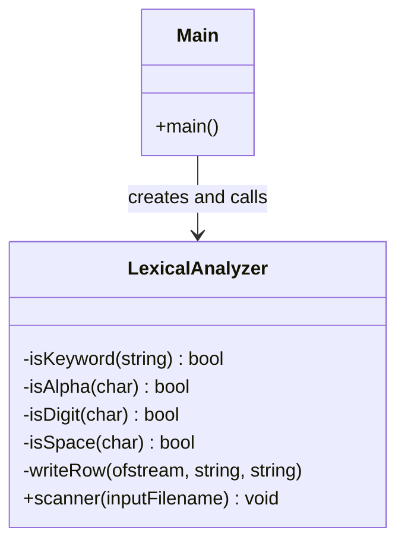
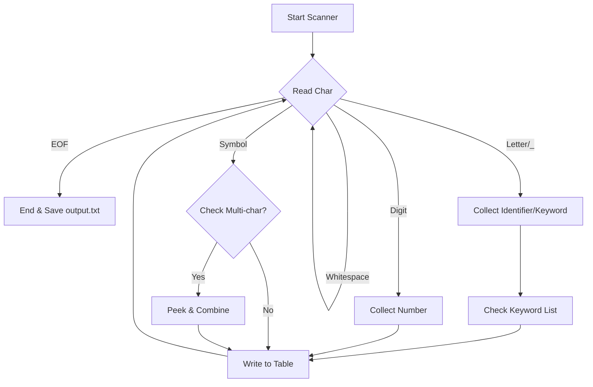

# Lexical Analyzer (Scanner) in C++

A simple, efficient lexical analyzer that reads source code from a file and breaks it down into a table of **Tokens** and **Lexemes**. It identifies keywords, identifiers, numbers, operators, and delimiters.

## 🚀 How to Use

1. **Prepare your input:** Create a file named `example.txt` in the same directory as the source code.
2. **Compile the code:**

```bash
g++ -o lexer main.cpp

```

3. **Run the program:**

```bash
./lexer

```

4. **View results:** Check `output.txt` for the formatted token table.

---

## 🏗️ Program Design

The program is designed using Object-Oriented principles. The `LexicalAnalyzer` class encapsulates the scanning logic, maintaining a clear separation between the file I/O and the character-processing logic.



---

## 🔄 Program Execution Flow

The scanner operates as a **Finite State Machine (FSM)**. It reads characters one by one and decides which "path" to take based on the first character of a lexeme.



---

## 🛠️ Features

- **Keyword Detection:** Recognizes standard C++ keywords (e.g., `int`, `if`, `while`).
- **Numerical Support:** Handles both integers and decimal points (e.g., `10` and `3.14`).
- **Lookahead Logic:** Correctly distinguishes between single operators (`<`) and multi-character operators (`<<` or `<=`).
- **Formatted Output:** Generates a clean, human-readable table in `output.txt`.

