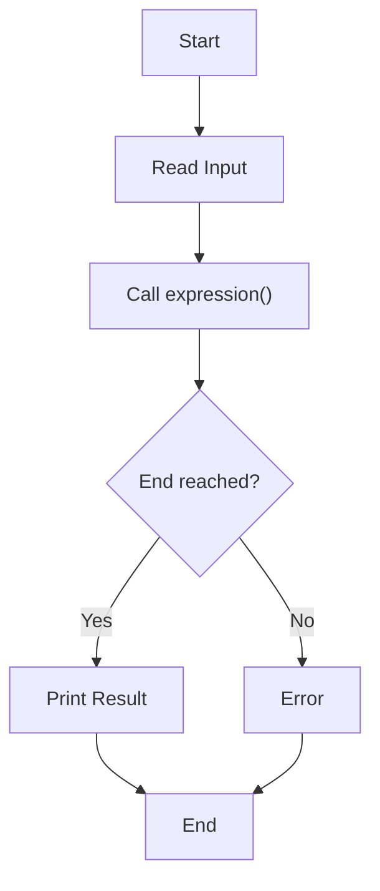
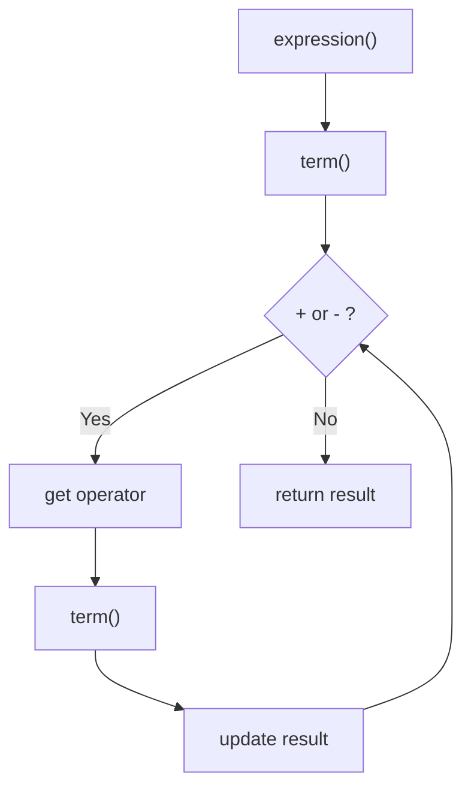
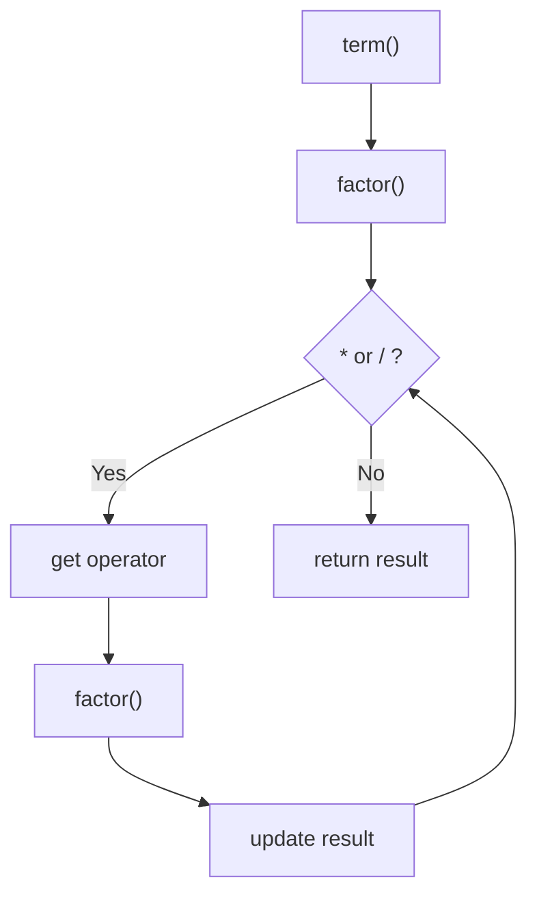
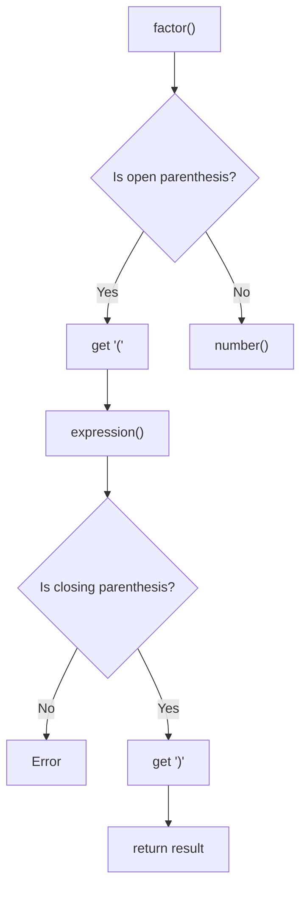
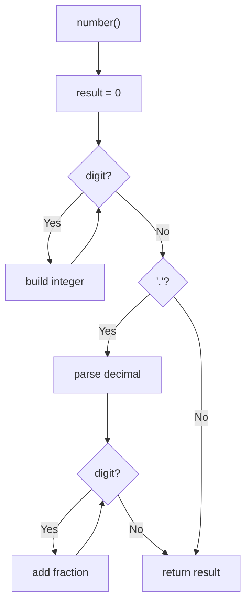

# Recursive Descent Parser (C++)

## Core Idea

This program evaluates mathematical expressions using **recursive descent parsing**.

It follows this grammar:

Expression → Term (+ or - Term)
Term → Factor (\* or / Factor)
Factor → Number or (Expression)

---

## How Code Works

- **input[]** → stores expression
- **pos** → acts like a pointer
- **peek()** → looks at current character
- **get()** → reads and moves forward

---

## Execution Flow



---

## Expression Function



---

## Term Function



---

## Factor Function



---

## Number Function



---

## Explanation (Step-by-Step)

The parser works in layers:

```
Expression → Term → Factor → Number
```

- **expression()** handles `+` and `-`
- **term()** handles `*` and `/`
- **factor()** handles parentheses
- **number()** reads numeric values

---

## Example

Input: **2+3\*4**

Steps:

1. expression() → term() → factor() → 2
2. See `+`
3. term() → 3 \* 4 = 12
4. Final result = 14

---

## Key Intuition

Operator precedence works automatically because of function hierarchy:

```
expression()
    ↓
term()
    ↓
factor()
    ↓
number()
```

Multiplication is evaluated before addition because `term()` is called inside `expression()`.

---

```

---

# 🧾 Summary

- This `.md` works perfectly on GitHub
- Mermaid diagrams render automatically on GitHub
- Cleaner than HTML for documentation
- Perfect for adding to your parser project README

